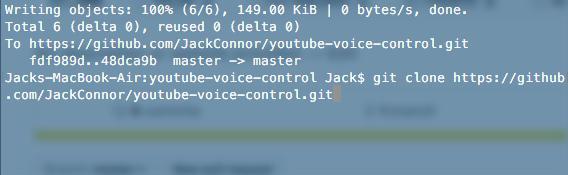
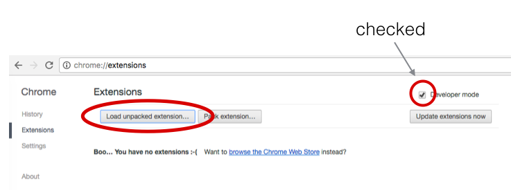
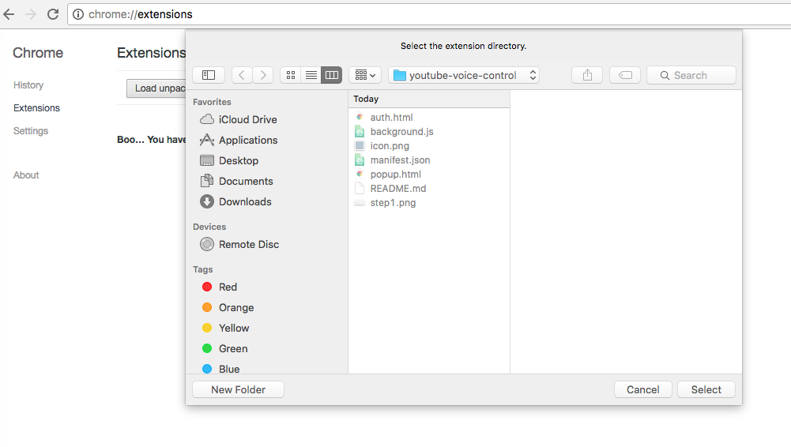
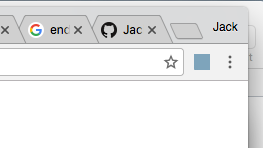

<h2>
  So you want to control youtube by voice, huh?
  </h2>
<h4>
  Well You've come to the right place. This is a simple Youtube chrome extension to control youtube with voice controls only. You'll find some documentation here, but please send me a note if you have any questions (or post an issue).
</h4>
<h4>
  Chrome extensions are very lightweight, so all you need to do is clone this repo anywhere you might want, and just follow the easy steps below (with pictures!).
</h4>
 
<h4>
  step 1:
    Clone repo into any folder
    </img>
</h4>
 
<h4>
  step 2:
    Open Chrome and type in chrome://extensions into the bar. When you get there, click "Load Unpacked Extension". You MUST be in developer mode to load extensions straight from your computer, so click that on immediately.
</h4>
</img>
 
<h4>
  step 3:
    Open this extension from the folder which you just cloned to your computer.
</h4>
</img>
 
<h4>
  step 4:
    If the icon appears, you're good!
</h4>
</img>
 
<h4>
  Have fun!
</h4>
<h3>Jack Connor</h3>
